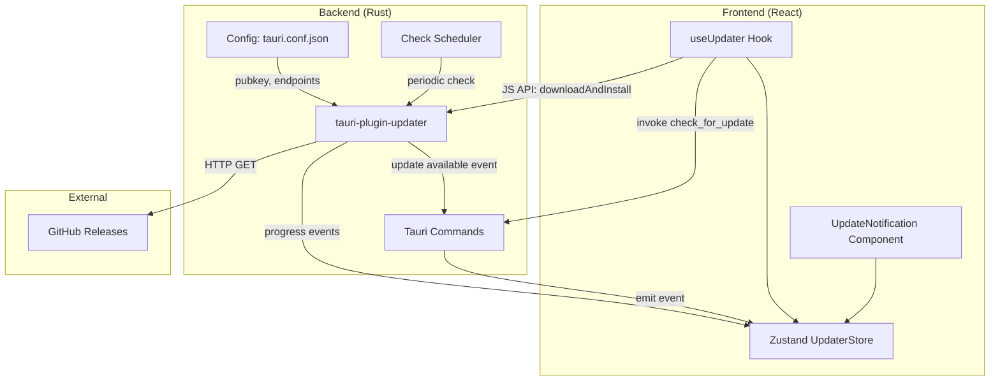
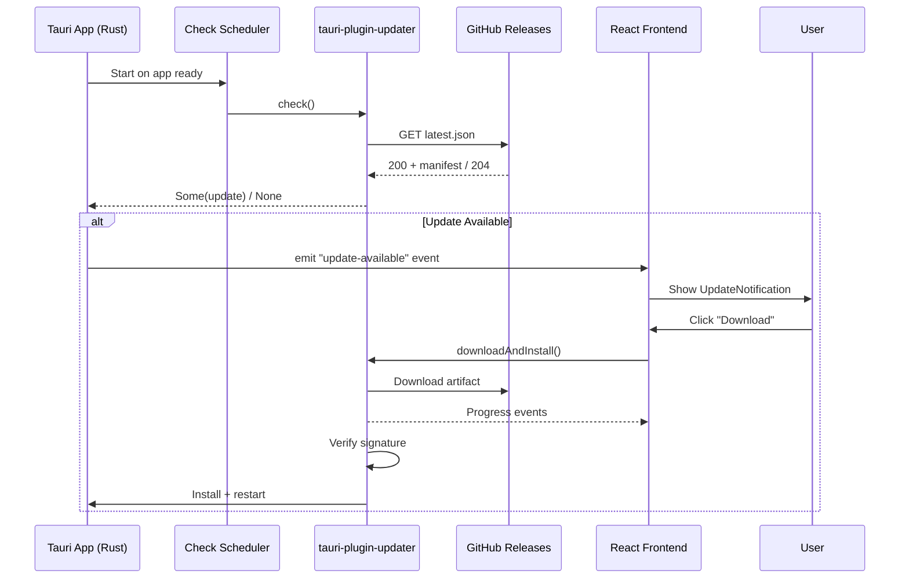

# Design Document: Auto-Updater

## Overview

The auto-updater feature provides seamless, secure in-app updates for Academix using `tauri-plugin-updater`. The system periodically checks GitHub Releases for new versions, presents a non-intrusive notification to the user with version info and release notes, and allows one-click download, verification, installation, and automatic restart.

The architecture follows the existing hexagonal pattern on the Rust side (domain logic for version comparison and scheduling; infrastructure for the plugin integration) and a dedicated feature module (`src/features/updater/`) on the frontend with a Zustand store for update state management.

Key design decisions:
- **Rust-side timer** for periodic checking (using `tokio::time::interval`) to keep scheduling independent of frontend lifecycle
- **Frontend-driven download** via `@tauri-apps/plugin-updater` JavaScript API for progress reporting
- **Zustand store** for centralized update state, enabling any component to react to update availability
- **GitHub Releases + static JSON** as the update endpoint (generated by `tauri-apps/tauri-action`)

## Architecture



### Update Flow



## Components and Interfaces

### Backend Components

#### 1. Plugin Registration (`src-tauri/src/lib.rs`)

Register `tauri-plugin-updater` in the Tauri builder:

```rust
.plugin(tauri_plugin_updater::Builder::new().build())
```

#### 2. Update Scheduler (`src-tauri/src/infrastructure/updater.rs`)

A background task spawned in `setup()` that:
- Performs an initial check within 10 seconds of window ready
- Repeats checks at the configured interval (default 4 hours)
- Emits `update-available` events to the frontend via `AppHandle::emit`

```rust
pub struct UpdateScheduler {
    app_handle: AppHandle,
    interval_hours: u64,
}

impl UpdateScheduler {
    pub async fn start(app_handle: AppHandle, interval_hours: u64);
}
```

#### 3. Tauri Commands (`src-tauri/src/commands/updater.rs`)

```rust
#[tauri::command]
pub async fn check_for_update(app: AppHandle) -> Result<Option<UpdateInfo>, String>;

#[tauri::command]
pub async fn get_update_check_interval() -> Result<u64, String>;

#[tauri::command]
pub async fn set_update_check_interval(hours: u64) -> Result<(), String>;
```

### Frontend Components

#### 1. Zustand Store (`src/features/updater/hooks/useUpdaterStore.ts`)

```typescript
interface UpdaterState {
  status: 'idle' | 'checking' | 'available' | 'downloading' | 'installing' | 'error';
  updateInfo: UpdateInfo | null;
  downloadProgress: number;
  error: string | null;
  dismissedVersion: string | null;
}

interface UpdaterActions {
  checkForUpdate: () => Promise<void>;
  startDownload: () => Promise<void>;
  dismiss: () => void;
  reset: () => void;
}
```

#### 2. UpdateNotification Component (`src/features/updater/components/UpdateNotification.tsx`)

A toast/banner component rendered at the top of the application layout:
- Displays version number and release notes (truncated to 5000 chars)
- Shows download progress bar during download
- "Download" and "Dismiss" buttons
- Error state display with retry option

#### 3. useUpdater Hook (`src/features/updater/hooks/useUpdater.ts`)

Orchestrates listening to backend events and triggering store updates:
- Subscribes to `update-available` Tauri event on mount
- Provides `checkForUpdate`, `startDownload`, `dismiss` actions
- Manages the JS-side `@tauri-apps/plugin-updater` API calls

### File Structure

```
src/features/updater/
├── components/
│   ├── UpdateNotification.tsx
│   └── DownloadProgress.tsx
├── hooks/
│   ├── useUpdater.ts
│   └── useUpdaterStore.ts
├── types/
│   └── updater.ts
└── index.ts
```

```
src-tauri/src/
├── commands/
│   └── updater.rs           # Tauri IPC commands
├── infrastructure/
│   └── updater.rs           # Scheduler + config persistence
```

## Data Models

### Update Info (shared between Rust → Frontend)

```typescript
interface UpdateInfo {
  version: string;       // SemVer: "1.2.3"
  releaseNotes: string;  // Max 5000 chars
  date: string;          // RFC 3339 timestamp
  mandatory: boolean;    // Whether update is mandatory
}
```

### Update Manifest (GitHub Releases JSON)

```json
{
  "version": "1.2.3",
  "notes": "Release notes markdown",
  "pub_date": "2025-01-01T00:00:00Z",
  "platforms": {
    "windows-x86_64": {
      "url": "https://github.com/.../academix-x86_64-setup.nsis.zip",
      "signature": "content of .sig file"
    },
    "darwin-aarch64": {
      "url": "https://github.com/.../academix.app.tar.gz",
      "signature": "..."
    },
    "linux-x86_64": {
      "url": "https://github.com/.../academix_amd64.AppImage.tar.gz",
      "signature": "..."
    }
  }
}
```

### Updater Configuration (`tauri.conf.json` addition)

```json
{
  "plugins": {
    "updater": {
      "pubkey": "<ED25519_PUBLIC_KEY>",
      "endpoints": [
        "https://github.com/luiferdev/academix/releases/latest/download/academix-{{target}}-{{arch}}.json"
      ],
      "windows": {
        "installMode": "passive"
      }
    }
  },
  "bundle": {
    "createUpdaterArtifacts": true
  }
}
```

### Tauri Capability Permission

Add to `src-tauri/capabilities/default.json`:

```json
"updater:default",
"process:default"
```

## Correctness Properties

*A property is a characteristic or behavior that should hold true across all valid executions of a system — essentially, a formal statement about what the system should do. Properties serve as the bridge between human-readable specifications and machine-verifiable correctness guarantees.*

### Property 1: SemVer Comparison Correctness

*For any* two valid SemVer version strings A and B, where B is semantically higher than A, the version comparison function SHALL return `true` for "update available", and for any pair where B is equal to or lower than A, it SHALL return `false`.

**Validates: Requirements 1.3**

### Property 2: Invalid Payload Rejection

*For any* response body that is not valid JSON or lacks the required `version`, `platforms`, and `signature` fields, the manifest parser SHALL return an error result and never produce a valid `UpdateInfo` struct.

**Validates: Requirements 1.5, 7.6**

### Property 3: Platform Key Construction

*For any* valid target identifier (windows, darwin, linux) and any valid architecture identifier (x86_64, aarch64, i686, armv7), the platform key constructor SHALL produce a string in the exact format `{target}-{arch}`.

**Validates: Requirements 2.1, 2.3, 7.7**

### Property 4: Platform Matching Exclusion

*For any* Update_Manifest whose `platforms` object does not contain the current Platform_Target as a key, the platform matcher SHALL return `None` (no valid update), regardless of the number of other platform entries present.

**Validates: Requirements 2.2**

### Property 5: URL Validation Constraint

*For any* artifact URL string, the URL validator SHALL accept it only when it is non-empty AND its length is 2048 characters or fewer. Empty strings or strings exceeding 2048 characters SHALL always be rejected.

**Validates: Requirements 2.5**

### Property 6: Release Notes Truncation

*For any* release notes string, the notification formatter SHALL produce output containing at most 5000 characters of notes content. Notes longer than 5000 characters SHALL be truncated to exactly 5000 characters.

**Validates: Requirements 3.1**

### Property 7: Dismissed Version Suppression

*For any* sequence of update checks where the user has dismissed version V, the notification system SHALL suppress display of version V on subsequent checks, and SHALL only display a notification when a version different from V is detected.

**Validates: Requirements 3.4**

### Property 8: Check Interval Persistence Round-Trip

*For any* valid interval value between 1 and 24 (inclusive), saving the interval and then reading it back SHALL return the same value. Values outside the range [1, 24] SHALL be rejected.

**Validates: Requirements 1.2**

### Property 9: HTTPS-Only Endpoint Enforcement

*For any* endpoint URL string, the endpoint validator SHALL accept only URLs whose scheme is `https`. Any URL with scheme `http` or any other non-TLS scheme SHALL be rejected.

**Validates: Requirements 7.2**

### Property 10: Retry with Exponential Backoff

*For any* sequence of N consecutive failures (where N ≤ 3), the retry mechanism SHALL attempt exactly N retries with delays of 1s, 2s, and 4s respectively before reporting failure.

**Validates: Requirements 7.5**

### Property 11: Public Key Validation

*For any* string that is not a valid Ed25519 public key (empty, wrong length, invalid encoding), the configuration validator SHALL reject it and prevent update checks from proceeding.

**Validates: Requirements 6.1**

## Error Handling

### Error Categories

| Category | Source | User Impact | Recovery |
|----------|--------|-------------|----------|
| Network unreachable | Update check | Silent, logged | Retry at next interval |
| Invalid manifest | Endpoint response | Silent (logged) or user notification | Retry at next interval |
| Signature mismatch | Download verification | Error toast | User can retry download |
| Download timeout | Network (>300s) | Error toast | User can retry |
| Installation failure | OS installer | Error toast, version preserved | User can retry |
| Restart failure | Process relaunch | Manual restart instruction | User manual action |

### Error Flow

1. **Transient errors** (network, timeout): Retry with exponential backoff (1s, 2s, 4s). After 3 failures, notify user.
2. **Permanent errors** (signature failure, invalid manifest): No retry, display error, log details.
3. **Installation errors**: Preserve current version, display error, allow retry.
4. **All errors**: Never crash the application. The updater is non-essential — failures must not disrupt normal app usage.

### Logging Strategy

- All errors logged with timestamp, error type, and context (URL, version attempted)
- Success events logged (last check time, version installed)
- Log destination: Rust `eprintln!` (consistent with existing project pattern)

## Testing Strategy

### Unit Tests (Vitest)

Focus on frontend logic that doesn't require the Tauri runtime:

- **Zustand store transitions**: Verify state machine transitions (idle → checking → available → downloading → installing)
- **Version formatting**: SemVer display formatting
- **Release notes truncation**: Ensure 5000-char limit
- **Dismissed version logic**: Store correctly suppresses dismissed versions

### Property-Based Tests (Vitest + fast-check)

Property-based testing is appropriate for this feature because the core logic involves:
- SemVer comparison (large input space of version strings)
- Platform key construction (combinatorial target × arch)
- URL validation (string length boundaries)
- Interval validation (numeric range)

**Library**: `fast-check` (well-maintained, TypeScript-native PBT library)
**Configuration**: Minimum 100 iterations per property test
**Tag format**: `Feature: auto-updater, Property {N}: {title}`

Properties to implement:
1. SemVer comparison correctness (Property 1)
2. Invalid payload rejection (Property 2)
3. Platform key construction format (Property 3)
4. Platform matching exclusion (Property 4)
5. URL validation constraint (Property 5)
6. Release notes truncation (Property 6)
7. Dismissed version suppression (Property 7)
8. Check interval round-trip (Property 8)
9. HTTPS-only enforcement (Property 9)
10. Retry backoff timing (Property 10)
11. Public key validation (Property 11)

### Integration Tests

- **Full update check cycle**: Mock GitHub endpoint, verify end-to-end flow
- **Event emission**: Verify Rust → Frontend event bridge works
- **Configuration persistence**: Verify interval survives app restart

### E2E Tests (Playwright - limited scope)

- Verify UpdateNotification renders when update state is "available"
- Verify dismiss button hides notification
- Verify download button triggers state change

### What is NOT tested with PBT

- UI rendering (use snapshot/example tests)
- Actual network calls to GitHub (use integration tests with mocks)
- OS-level installation (use E2E on CI with real builds)
- Restart behavior (manual QA)
