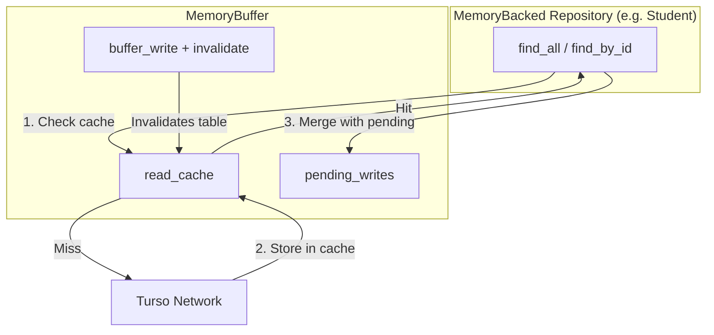
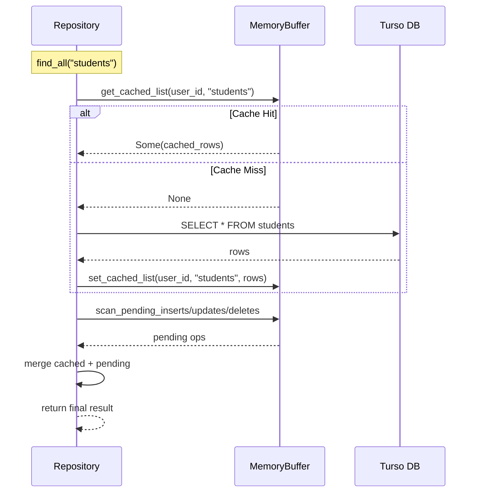

# Design Document: Read Cache

## Overview

Add an in-memory read cache layer inside the existing `MemoryBuffer` struct to eliminate redundant Turso network calls for repeated reads within a session. The cache stores raw query results (as `Vec<HashMap<String, String>>` for lists, `Option<HashMap<String, String>>` for entities) and is invalidated per-table whenever `buffer_write` targets that table. This removes 100-300ms latency on repeated reads without changing the existing write buffer, flush loop, or connection manager logic.

## Architecture





## Components and Interfaces

### MemoryBuffer (Modified)

**Location**: `src-tauri/src/infrastructure/turso/memory_buffer.rs`

The existing `MemoryBuffer` struct is extended with read cache capabilities. No new structs are created — the cache lives inside the buffer.

**Public Interface (new methods)**:

| Method | Signature | Description |
|--------|-----------|-------------|
| `get_cached_list` | `(&self, user_id: &str, table: &str) -> Option<&Vec<HashMap<String, String>>>` | Returns cached list for a table, or None on miss |
| `set_cached_list` | `(&mut self, user_id: &str, table: &str, data: Vec<HashMap<String, String>>)` | Stores a full-table list result in cache |
| `get_cached_entity` | `(&self, user_id: &str, table: &str, id: &str) -> Option<&Option<HashMap<String, String>>>` | Returns cached entity lookup, or None on miss |
| `set_cached_entity` | `(&mut self, user_id: &str, table: &str, id: &str, data: Option<HashMap<String, String>>)` | Stores a single entity lookup result |
| `invalidate_table_cache` | `(&mut self, user_id: &str, table: &str)` | Removes all cache entries for a given table+user |
| `clear_user_cache` | `(&mut self, user_id: &str)` | Removes all cache entries for a user (session end) |
| `clear_all_read_cache` | `(&mut self)` | Clears entire read cache (full reset) |

**Modified method**:

| Method | Change |
|--------|--------|
| `buffer_write` | After pushing op to pending_writes, calls `invalidate_table_cache(user_id, table)` |

### MemoryBacked Repositories (Modified)

**Location**: `src-tauri/src/infrastructure/repositories/memory_backed/*.rs`

Each of the 7 repositories adds:
- A `row_to_hash_map(row: &libsql::Row) -> Result<HashMap<String, String>, DomainError>` helper
- Cache-check-before-Turso logic in `find_all` and `find_by_id`

**Interface unchanged** — all repository trait methods retain the same signatures. The change is internal implementation only.

### Constants

| Name | Value | Location |
|------|-------|----------|
| `CACHEABLE_TABLES` | `["students", "courses", "groups_table", "payments", "attendance", "accounting_entries", "users"]` | `memory_buffer.rs` |

## Data Models

### ReadCacheEntry (New Enum)

```rust
#[derive(Debug, Clone)]
pub enum ReadCacheEntry {
    /// Full-table list query result (find_all, find_by_X)
    List(Vec<HashMap<String, String>>),
    /// Single entity lookup result (find_by_id)
    Entity(Option<HashMap<String, String>>),
}
```

### Cache Storage Layout

```
read_cache: HashMap<String, HashMap<String, ReadCacheEntry>>
             │                  │                │
             └─ user_id         └─ cache_key     └─ List or Entity
                                   │
                                   ├─ "students"           → List(...)
                                   ├─ "students:{id}"      → Entity(Some/None)
                                   ├─ "courses"            → List(...)
                                   └─ "courses:{id}"       → Entity(Some/None)
```

### Entity Data Format

Entities are stored as `HashMap<String, String>` where keys are column names and values are string-serialized column values. This matches the existing `BufferedOperation::Insert { data }` format already used by the write buffer, enabling zero-cost compatibility between cached reads and pending writes.

### Removed Types

| Type | Reason |
|------|--------|
| `CachedEntity` struct | Replaced by `ReadCacheEntry::Entity` |
| `cached_entities` field | Replaced by `read_cache` field |

## Error Handling

### Cache Miss (not an error)

A cache miss is a normal state — the repository falls through to query Turso. No error is raised.

### Corrupt Cache Entry

If a cached `HashMap<String, String>` cannot be deserialized into the domain entity (e.g., missing required field), the repository:
1. Discards the invalid cache entry (`invalidate_table_cache`)
2. Queries Turso directly
3. Stores the fresh result
4. Returns normally — no error propagated to the user

### Turso Network Error on Cache Repopulation

If Turso is unreachable during a cache miss:
1. The existing `DomainError::Database(...)` is returned to the caller
2. The cache is NOT populated (stays empty for that table)
3. Next read attempt will try Turso again

### Mutex Poisoning

`tokio::sync::Mutex` does not poison on panic (unlike `std::sync::Mutex`). No special handling needed.

### Memory Pressure

The cache has no size limit. For the target use case (single-academy desktop app with hundreds, not millions, of records), unbounded cache is acceptable. If needed in the future, an LRU eviction strategy can be added without changing the public interface.

## Data Flow

### Read Path (Cache Miss → Populate)

1. Repository calls `get_cached_list(user_id, table)` or `get_cached_entity(user_id, table, id)`
2. On miss: query Turso, serialize rows to `Vec<HashMap<String, String>>`, call `set_cached_list` / `set_cached_entity`
3. Merge cached/fetched data with pending buffer writes (existing logic unchanged)
4. Return final result

### Read Path (Cache Hit)

1. Repository calls `get_cached_list` / `get_cached_entity`
2. On hit: skip Turso query entirely
3. Merge cached data with pending buffer writes (same merge step)
4. Return final result

### Write Path (Invalidation)

1. Repository calls `buffer_write(user_id, op)` (unchanged interface)
2. Inside `buffer_write`: push op to `pending_writes`, extract table name from op, call `invalidate_table_cache(user_id, table)`
3. Next read for that table will miss cache → re-fetch from Turso

## API Design

### New Types

```rust
/// Cached read result for a table query or entity lookup.
#[derive(Debug, Clone)]
pub enum ReadCacheEntry {
    /// Full-table list query result (e.g., find_all)
    List(Vec<HashMap<String, String>>),
    /// Single entity lookup result (e.g., find_by_id)
    Entity(Option<HashMap<String, String>>),
}
```

### Modified MemoryBuffer Fields

```rust
pub struct MemoryBuffer {
    pending_writes: HashMap<String, Vec<BufferedOperation>>,
    /// Read cache: user_id → cache_key → entry
    /// cache_key format: "{table}" for lists, "{table}:{id}" for entities
    read_cache: HashMap<String, HashMap<String, ReadCacheEntry>>,
    last_write_at: Instant,
    flush_notify: Arc<Notify>,
}
```

The `cached_entities: HashMap<String, HashMap<String, CachedEntity>>` field and its associated `CachedEntity` struct, `cache_entity`, `get_cached`, `clear_cache`, and `clear_all_caches` methods are replaced entirely.

### New MemoryBuffer Methods

```rust
/// Tables that support read caching.
const CACHEABLE_TABLES: &[&str] = &[
    "students", "courses", "groups_table",
    "payments", "attendance", "accounting_entries", "users",
];

impl MemoryBuffer {
    /// Get cached list result for a table.
    /// Returns None on cache miss.
    pub fn get_cached_list(
        &self,
        user_id: &str,
        table: &str,
    ) -> Option<&Vec<HashMap<String, String>>> {
        if !CACHEABLE_TABLES.contains(&table) {
            return None;
        }
        self.read_cache
            .get(user_id)
            .and_then(|entries| entries.get(table))
            .and_then(|entry| match entry {
                ReadCacheEntry::List(data) => Some(data),
                _ => None,
            })
    }

    /// Store a list result in the cache.
    pub fn set_cached_list(
        &mut self,
        user_id: &str,
        table: &str,
        data: Vec<HashMap<String, String>>,
    ) {
        if !CACHEABLE_TABLES.contains(&table) {
            return;
        }
        self.read_cache
            .entry(user_id.to_string())
            .or_default()
            .insert(table.to_string(), ReadCacheEntry::List(data));
    }

    /// Get a cached single-entity lookup result.
    /// Returns None on cache miss.
    pub fn get_cached_entity(
        &self,
        user_id: &str,
        table: &str,
        id: &str,
    ) -> Option<&Option<HashMap<String, String>>> {
        if !CACHEABLE_TABLES.contains(&table) {
            return None;
        }
        let key = format!("{}:{}", table, id);
        self.read_cache
            .get(user_id)
            .and_then(|entries| entries.get(&key))
            .and_then(|entry| match entry {
                ReadCacheEntry::Entity(data) => Some(data),
                _ => None,
            })
    }

    /// Store a single-entity lookup result in the cache.
    pub fn set_cached_entity(
        &mut self,
        user_id: &str,
        table: &str,
        id: &str,
        data: Option<HashMap<String, String>>,
    ) {
        if !CACHEABLE_TABLES.contains(&table) {
            return;
        }
        let key = format!("{}:{}", table, id);
        self.read_cache
            .entry(user_id.to_string())
            .or_default()
            .insert(key, ReadCacheEntry::Entity(data));
    }

    /// Invalidate all cached entries for a specific table.
    /// Called inside `buffer_write` after pushing the operation.
    pub fn invalidate_table_cache(&mut self, user_id: &str, table: &str) {
        if let Some(entries) = self.read_cache.get_mut(user_id) {
            // Remove the list entry for this table
            entries.remove(table);
            // Remove all entity entries for this table (keys starting with "{table}:")
            let prefix = format!("{}:", table);
            entries.retain(|key, _| !key.starts_with(&prefix));
        }
    }

    /// Clear all read cache entries for a user (on session end/disconnect).
    pub fn clear_user_cache(&mut self, user_id: &str) {
        self.read_cache.remove(user_id);
    }

    /// Clear all read cache entries (on full reset).
    pub fn clear_all_read_cache(&mut self) {
        self.read_cache.clear();
    }
}
```

### Modified `buffer_write`

```rust
pub fn buffer_write(&mut self, user_id: &str, op: BufferedOperation) {
    // Extract table name before pushing
    let table = match &op {
        BufferedOperation::Insert { table, .. } => table.clone(),
        BufferedOperation::Update { table, .. } => table.clone(),
        BufferedOperation::Delete { table, .. } => table.clone(),
    };

    println!(
        "[BUFFER] Write for user='{}', op={}",
        user_id,
        match &op {
            BufferedOperation::Insert { table, .. } => format!("INSERT {}", table),
            BufferedOperation::Update { table, id, .. } => format!("UPDATE {} id={}", table, id),
            BufferedOperation::Delete { table, id } => format!("DELETE {} id={}", table, id),
        }
    );

    self.pending_writes
        .entry(user_id.to_string())
        .or_default()
        .push(op);
    self.last_write_at = Instant::now();

    // Invalidate read cache for the affected table
    self.invalidate_table_cache(user_id, &table);

    // Signal flush loop to wake immediately
    self.flush_notify.notify_one();
}
```

### Repository Integration Pattern

Each repository's `find_all` becomes:

```rust
async fn find_all(&self) -> Result<Vec<Student>, DomainError> {
    let user_id = self.get_user_id().await?;

    // Step 1: Check cache or query Turso
    let base_rows: Vec<HashMap<String, String>> = {
        let buf = self.memory_buffer.lock().await;
        if let Some(cached) = buf.get_cached_list(&user_id, "students") {
            cached.clone()
        } else {
            drop(buf); // Release lock before network call

            // Query Turso
            let sql = "SELECT ... FROM students WHERE active = 1 ORDER BY ...";
            let mut rows = self.query_turso(&user_id, sql, libsql::params![]).await?;
            let mut raw_rows: Vec<HashMap<String, String>> = Vec::new();
            while let Some(row) = rows.next().await.map_err(...)? {
                raw_rows.push(Self::row_to_hash_map(&row)?);
            }

            // Store in cache
            let mut buf = self.memory_buffer.lock().await;
            buf.set_cached_list(&user_id, "students", raw_rows.clone());
            raw_rows
        }
    };

    // Step 2: Convert rows to domain entities
    let mut results: Vec<Student> = base_rows
        .iter()
        .map(|data| Self::student_from_data(data))
        .collect::<Result<Vec<_>, _>>()?;

    // Step 3: Merge with pending writes (existing logic, unchanged)
    let buf = self.memory_buffer.lock().await;
    // ... apply pending inserts, updates, deletes ...

    Ok(results)
}
```

Each repository's `find_by_id` becomes:

```rust
async fn find_by_id(&self, id: &str) -> Result<Option<Student>, DomainError> {
    let user_id = self.get_user_id().await?;

    // Check pending buffer first (existing behavior)
    {
        let buf = self.memory_buffer.lock().await;
        if let Some(op) = buf.find_pending_insert(&user_id, "students", id) { ... }
        if let Some(op) = buf.find_pending_update(&user_id, "students", id) { ... }
        if buf.has_pending_delete(&user_id, "students", id) { return Ok(None); }
    }

    // Check entity cache or query Turso
    let row_data: Option<HashMap<String, String>> = {
        let buf = self.memory_buffer.lock().await;
        if let Some(cached) = buf.get_cached_entity(&user_id, "students", id) {
            cached.clone()
        } else {
            drop(buf);

            let sql = "SELECT ... FROM students WHERE id = ?1";
            let mut rows = self.query_turso(&user_id, sql, libsql::params![id]).await?;
            let data = match rows.next().await.map_err(...)? {
                Some(row) => Some(Self::row_to_hash_map(&row)?),
                None => None,
            };

            let mut buf = self.memory_buffer.lock().await;
            buf.set_cached_entity(&user_id, "students", id, data.clone());
            data
        }
    };

    match row_data {
        Some(data) => Ok(Some(Self::student_from_data(&data)?)),
        None => Ok(None),
    }
}
```

### Helper Method (added to each repository)

Each repository needs a `row_to_hash_map` method to serialize a `libsql::Row` into `HashMap<String, String>` for cache storage:

```rust
fn row_to_hash_map(row: &libsql::Row) -> Result<HashMap<String, String>, DomainError> {
    let mut map = HashMap::new();
    map.insert("id".to_string(), row.get::<String>(0).map_err(...)?);
    map.insert("user_id".to_string(), row.get::<String>(1).map_err(...)?);
    // ... all columns for this table
    Ok(map)
}
```

## File Changes

| File | Change |
|------|--------|
| `src-tauri/src/infrastructure/turso/memory_buffer.rs` | Remove `CachedEntity` struct and `cached_entities` field. Add `ReadCacheEntry` enum, `read_cache` field, `CACHEABLE_TABLES` const, new methods (`get_cached_list`, `set_cached_list`, `get_cached_entity`, `set_cached_entity`, `invalidate_table_cache`, `clear_user_cache`, `clear_all_read_cache`). Modify `buffer_write` to call `invalidate_table_cache`. Replace `clear_cache`/`clear_all_caches` with new equivalents. Update tests. |
| `src-tauri/src/infrastructure/repositories/memory_backed/student.rs` | Add `row_to_hash_map`. Modify `find_all` and `find_by_id` to check/populate cache before Turso. |
| `src-tauri/src/infrastructure/repositories/memory_backed/group.rs` | Same pattern. Also update `find_by_course_id` and `find_by_professor_id` (these use table-level list cache, same key). |
| `src-tauri/src/infrastructure/repositories/memory_backed/course.rs` | Same pattern. |
| `src-tauri/src/infrastructure/repositories/memory_backed/payment.rs` | Same pattern. |
| `src-tauri/src/infrastructure/repositories/memory_backed/attendance.rs` | Same pattern. |
| `src-tauri/src/infrastructure/repositories/memory_backed/accounting.rs` | Same pattern. |
| `src-tauri/src/infrastructure/repositories/memory_backed/user.rs` | Same pattern. |

## Testing Strategy

### Unit Tests (MemoryBuffer)

- `test_set_and_get_cached_list` — set a list, retrieve it, confirm match
- `test_set_and_get_cached_entity` — set an entity, retrieve it, confirm match
- `test_cache_miss_returns_none` — no entry → None
- `test_invalidate_table_clears_list_and_entities` — after invalidation, both list and entity entries for that table are gone
- `test_invalidate_preserves_other_tables` — invalidating "students" doesn't touch "courses" cache
- `test_buffer_write_invalidates_cache` — writing to "students" clears "students" cache
- `test_non_cacheable_table_bypasses_cache` — set/get for "sessions" returns None
- `test_clear_user_cache` — clears only that user's entries
- `test_clear_all_read_cache` — clears everything

### Integration Tests (Repository level)

- `find_all` returns same result on second call without network (mock Turso to verify single call)
- `find_by_id` caches individual entity
- After `save`/`update`/`delete`, next `find_all` re-queries Turso
- Pending writes still merge correctly with cached data
- Different users don't see each other's cached data

## Correctness Properties

*A property is a characteristic or behavior that should hold true across all valid executions of a system — essentially, a formal statement about what the system should do. Properties serve as the bridge between human-readable specifications and machine-verifiable correctness guarantees.*

### Property 1: Cache transparency

*For any* sequence of read operations on a table with no intervening writes, the result SHALL be identical whether served from cache or from Turso directly.

**Validates: Requirements 2.3, 2.4**

### Property 2: Write invalidation completeness

*For any* `buffer_write` operation targeting table X, all cached list and entity entries for table X for that user SHALL be removed from the cache immediately after the write.

**Validates: Requirements 3.1, 3.2**

### Property 3: Cross-user isolation

*For any* two distinct user_ids A and B, cache operations (set, get, invalidate) performed under user A SHALL never read, modify, or delete entries belonging to user B.

**Validates: Requirements 5.1, 5.3**

### Property 4: Merge correctness with cache

*For any* cached list result and any set of pending buffer writes, the merged output SHALL be identical to the output produced by merging the same Turso result with the same pending writes (i.e., caching does not affect merge semantics).

**Validates: Requirements 4.1, 4.2, 4.3**

### Property 5: Non-cacheable table bypass

*For any* table NOT in `CACHEABLE_TABLES`, calls to `get_cached_list` and `get_cached_entity` SHALL always return None, and calls to `set_cached_list` and `set_cached_entity` SHALL be no-ops.

**Validates: Requirements 6.2**
